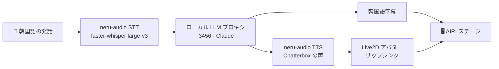

<!-- 프로젝트 소개(일본어 에디션) — EN/KO 에디션과 상단 링크로 연결 -->
# neru

[English](README.md) · [한국어](README.ko.md) · **日本語**

> Neuro-sama級を目指して作る AI VTuber。あなたが**韓国語**で話しかけると、neru は
> **英語の声**で応答し、画面には**韓国語字幕**が表示され、Live2D アバターがその音声に
> 合わせてリップシンクする。

neru は単一のデスクトップアプリだ。[Project AIRI](https://github.com/moeru-ai/airi)
のフォークがアプリ全体（アバター・会話・オーケストレーション・字幕）を担い、neru
固有の資産であるローカル **GPU 音声スタック**をサービスとして統合している。言語
モデルは既存のローカル OpenAI 互換プロキシで、neru はその宛先を指すだけだ。

---

## なぜ neru か

Neuro-sama は、リアルタイム会話型 AI VTuber がどこまで行けるかを示した。neru は
その水準に到達し、さらに先へ進もうとする試みであり、手を広げる前に**一つの垂直
スライスを最後までやり切る**方針で作る。その最初のスライスが**リアルタイム音声
会話コア**だ。声が入り、音声の返答が出て、アバターが反応し、字幕が同期する。

アイデンティティは意図的だ。**韓国語を理解し、英語で話し、韓国語で見せる。**
あなたは自分の言語で話し、neru は（Neuro-sama のように）英語で演じつつ、画面は
あなたを韓国語で支える。

## 仕組み



- **STT / TTS** は `neru-audio` ゲートウェイ内でローカル GPU 上で動く。
- **LLM** は `localhost:3456` のローカル OpenAI 互換プロキシ（Claude）で、この
  リポジトリのコードではなく、neru は接続するだけだ。
- **AIRI** がマイク・ターンテイキング・アバター・字幕描画を担当する。

## アーキテクチャ

システムは一つ。移植不可能な固有資産（Chatterbox の音声クローン + faster-whisper、
どちらも Python + CUDA が必要）だけを小さな HTTP ゲートウェイに残し、残りは AIRI
フォークだ。

| 構成 | 役割 | 技術 |
|------|------|------|
| `airi/`（Project AIRI フォーク） | デスクトップアプリ: アバター・会話 UI・オーケストレーション・字幕 | Vue 3 · Electron · pnpm モノレポ |
| `airi/services/neru-audio/` | `127.0.0.1:3457` の OpenAI 互換 GPU 音声ゲートウェイ | Python · FastAPI · Chatterbox TTS · faster-whisper STT |
| ローカル LLM プロキシ（外部） | チャット補完、OpenAI 互換 | `localhost:3456` |

デスクトップアプリ（`airi/apps/stage-tamagotchi`, Electron）は開発モードで
ゲートウェイを**自動起動**し、provider 設定をあらかじめ埋め込むことでオンボーディング
なしに三つのサービス（LLM・STT・TTS）へ直接つなぐ。

## リポジトリ構成

```
neurosama-ai/
├─ airi/                            # 唯一のランタイム — vendored Project AIRI フォーク（MIT）
│  ├─ apps/stage-tamagotchi/        # Electron デスクトップアプリ（ゲートウェイ自動起動）
│  ├─ services/neru-audio/          # Python GPU 音声ゲートウェイ（STT + TTS, OpenAI 互換）
│  └─ …                             # AIRI の残り
├─ .github/workflows/               # CI: @claude アシスタント、PR 助言レビュー
├─ docs/                            # 仕様・計画
└─ README · WORKSPACE · checklist   # プロジェクト文書
```

## はじめに

**前提条件**

- Node.js + [pnpm](https://pnpm.io/)（AIRI モノレポ）
- Python 3.11 + [uv](https://docs.astral.sh/uv/)（ゲートウェイ）
- CUDA 対応 NVIDIA GPU（RTX 5080 / Blackwell, `torch 2.9.0+cu128` で開発）
- `localhost:3456` で動作するローカル OpenAI 互換 LLM プロキシ

**デスクトップアプリの起動**（`airi/` から）

```bash
cd airi
pnpm install
pnpm desktop        # Electron バイナリを補完し stage-tamagotchi を起動
```

開発モードでは `neru-audio` ゲートウェイが自動起動し、終了時に一緒に片付けられる。
ゲートウェイを単体で動かす場合は次のようにする。

```bash
cd airi/services/neru-audio
uv run neru-audio   # 127.0.0.1:3457 で待ち受け
```

## neru-audio ゲートウェイ

AIRI がカスタムコードなしで接続できるようにした OpenAI 互換オーディオサーバーだ。

| エンドポイント | 用途 |
|---------------|------|
| `POST /v1/audio/speech` | TTS — Chatterbox、短い参照クリップから複製した声 |
| `POST /v1/audio/transcriptions` | STT — faster-whisper large-v3、韓国語向け |
| `GET /v1/models` | クライアント確認用のモデル一覧 |

`/v1/audio/*` へのリクエストは `Authorization: Bearer` トークン（既定は
`sk-local-proxy`、`NERU_API_KEY` で変更可）を要求し、ローカルホストに制限される。
ゲートウェイが起動している間に他のウェブページがドライブバイで送るリクエストを
防ぐための対策だ。`127.0.0.1:3457` のみにバインドする。

## 自律開発パイプライン

このリポジトリは Claude で自らを保守するが、**人間が常に最終判断を下す**設計だ。
人間なしに何もマージされない。

- **夜間セキュリティ監査**・**バグハント**（スケジュール実行の Claude Routine）が
  実在の指摘を GitHub Issue として開き、`security` / `bug` / `claude-fix` ラベルを
  付ける。
- **Issue → 修正**（`claude-fix` ラベルをトリガーとする Routine）が `claude/*`
  ブランチに修正 PR を開く。
- **助言レビュー**（`claude-fix-review.yml`）が各修正 PR に `VERDICT:` の推奨
  コメントを残す。**読み取りとコメントのみで、マージ権限はない。**だから最終判断は
  常に人間のものだ。`master` はブランチ保護されている。

## ロードマップ

- ☑ AIRI フォークを唯一のシステムとして起動、プロキシ経由でローカル LLM に接続
- ☑ `neru-audio` GPU ゲートウェイ（Chatterbox TTS + faster-whisper STT）の自動起動
- ☐ 完全なライブループ（マイク → STT → LLM → TTS → アバター）と割り込み
- ☐ AIRI への二言語出力の配線 — **英語音声 + 韓国語字幕**
- ☐ neru 固有の魔女 Live2D モデルを AIRI ローダーへ
- ☐ neru ペルソナ / キャラクターカード
- ☐ リブランド + ランタイム同梱のパッケージビルド

## クレジット・ライセンス

- [Project AIRI](https://github.com/moeru-ai/airi) — MIT。`airi/` 配下に vendored、
  `airi/LICENSE` を参照。
- [Chatterbox](https://github.com/resemble-ai/chatterbox)（TTS）,
  [faster-whisper](https://github.com/SYSTRAN/faster-whisper)（STT）— MIT。
- [Neuro-sama](https://www.twitch.tv/vedal987) にインスパイア。

neru 固有のコードは上記 MIT コンポーネントの上に成り立っている。個人プロジェクト
であり、トップレベルの `LICENSE` が別途明示しない限り provided-as-is とみなす。
