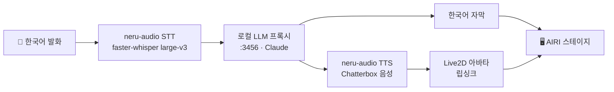

<!-- 프로젝트 소개(한국어 에디션) — EN/JA 에디션과 상단 링크로 연결 -->
# neru

[English](README.md) · **한국어** · [日本語](README.ja.md)

> Neuro-sama급을 목표로 만드는 AI 버튜버. 당신이 **한국어**로 말하면 neru가
> **영어 음성**으로 답하고, 화면엔 **한국어 자막**이 뜨며, Live2D 아바타가 그
> 음성에 맞춰 립싱크한다.

neru는 하나의 데스크톱 앱이다. [Project AIRI](https://github.com/moeru-ai/airi)
포크가 앱 전반(아바타·대화·오케스트레이션·자막)을 담당하고, neru 고유 자산인
로컬 **GPU 음성 스택**을 서비스로 통합했다. 언어 모델은 이미 존재하는 로컬
OpenAI 호환 프록시이며, neru는 그 주소만 가리킨다.

---

## 왜 neru인가

Neuro-sama는 실시간 대화형 AI 버튜버가 어디까지 갈 수 있는지 보여줬다. neru는
그 수준에 도달하고 더 나아가려는 시도이며, 넓히기 전에 **하나의 수직 슬라이스를
끝까지 완성**하는 방식으로 만든다. 그 첫 슬라이스가 **실시간 음성 대화 코어**다.
말이 들어오고, 음성 답변이 나가고, 아바타가 반응하고, 자막이 동기화된다.

정체성은 의도적이다. **한국어를 알아듣고, 영어로 말하고, 한국어로 보여준다.**
당신은 당신의 언어로 말하고, neru는 (Neuro-sama처럼) 영어로 연기하되 화면은
당신을 한국어로 붙잡아 둔다.

## 동작 방식



- **STT / TTS** 는 `neru-audio` 게이트웨이 안에서 로컬 GPU로 돈다.
- **LLM** 은 `localhost:3456` 의 로컬 OpenAI 호환 프록시(Claude)이며, 이 저장소의
  코드가 아니라 neru가 연결만 한다.
- **AIRI** 가 마이크·턴테이킹·아바타·자막 렌더를 맡는다.

## 아키텍처

시스템은 하나다. 이식 불가능한 고유 자산(Chatterbox 음성 클로닝 + faster-whisper,
둘 다 Python + CUDA 필요)만 작은 HTTP 게이트웨이로 남기고, 나머지는 AIRI 포크다.

| 구성 | 역할 | 기술 |
|------|------|------|
| `airi/` (Project AIRI 포크) | 데스크톱 앱: 아바타·대화 UI·오케스트레이션·자막 | Vue 3 · Electron · pnpm 모노레포 |
| `airi/services/neru-audio/` | `127.0.0.1:3457` OpenAI 호환 GPU 음성 게이트웨이 | Python · FastAPI · Chatterbox TTS · faster-whisper STT |
| 로컬 LLM 프록시 (외부) | 채팅 컴플리션, OpenAI 호환 | `localhost:3456` |

데스크톱 앱(`airi/apps/stage-tamagotchi`, Electron)은 개발 모드에서 게이트웨이를
**자동 기동**하고, provider 설정을 미리 심어 온보딩 없이 세 서비스(LLM·STT·TTS)에
바로 연결한다.

## 저장소 구조

```
neurosama-ai/
├─ airi/                            # 유일한 런타임 — vendored Project AIRI 포크(MIT)
│  ├─ apps/stage-tamagotchi/        # Electron 데스크톱 앱(게이트웨이 자동 기동)
│  ├─ services/neru-audio/          # Python GPU 음성 게이트웨이(STT + TTS, OpenAI 호환)
│  └─ …                             # 나머지 AIRI
├─ .github/workflows/               # CI: @claude 어시스턴트, PR 권고 리뷰
├─ docs/                            # 스펙 · 계획
└─ README · WORKSPACE · checklist   # 프로젝트 문서
```

## 시작하기

**사전 준비**

- Node.js + [pnpm](https://pnpm.io/) (AIRI 모노레포)
- Python 3.11 + [uv](https://docs.astral.sh/uv/) (게이트웨이)
- CUDA 지원 NVIDIA GPU (RTX 5080 / Blackwell, `torch 2.9.0+cu128` 기준으로 개발)
- `localhost:3456` 에서 도는 로컬 OpenAI 호환 LLM 프록시

**데스크톱 앱 실행** (`airi/` 에서)

```bash
cd airi
pnpm install
pnpm desktop        # Electron 바이너리 보강 후 stage-tamagotchi 기동
```

개발 모드에선 `neru-audio` 게이트웨이가 자동으로 뜨고 종료 시 함께 정리된다.
게이트웨이만 따로 돌리려면 아래와 같이 한다.

```bash
cd airi/services/neru-audio
uv run neru-audio   # 127.0.0.1:3457 서빙
```

## neru-audio 게이트웨이

AIRI가 커스텀 코드 없이 붙도록 만든 OpenAI 호환 오디오 서버다.

| 엔드포인트 | 용도 |
|-----------|------|
| `POST /v1/audio/speech` | TTS — Chatterbox, 짧은 레퍼런스 클립으로 복제한 음성 |
| `POST /v1/audio/transcriptions` | STT — faster-whisper large-v3, 한국어에 맞춤 |
| `GET /v1/models` | 클라이언트 조회용 모델 목록 |

`/v1/audio/*` 요청은 `Authorization: Bearer` 토큰(기본 `sk-local-proxy`,
`NERU_API_KEY` 로 변경)을 요구하고 로컬 호스트로 제한된다. 게이트웨이가 떠 있는
동안 다른 웹페이지가 드라이브바이로 쏘는 요청을 막기 위한 방어다.
`127.0.0.1:3457` 에만 바인딩한다.

## 자율 개발 파이프라인

이 저장소는 Claude로 스스로를 유지·보수하되, **사람이 항상 최종 결정**하는
구조다. 사람 없이는 아무것도 병합되지 않는다.

- **새벽 보안 감사**·**버그 헌팅**(예약 Claude Routine)이 실제 발견을 GitHub
  이슈로 열고 `security` / `bug` / `claude-fix` 라벨을 단다.
- **이슈 → 수정**(`claude-fix` 라벨 트리거 Routine)이 `claude/*` 브랜치에 수정
  PR을 연다.
- **권고 리뷰**(`claude-fix-review.yml`)가 각 수정 PR에 `VERDICT:` 권고 코멘트를
  남긴다. **읽기·코멘트만 가능하고 병합 권한은 없다.** 그래서 최종 판단은 늘
  사람 몫이다. `master`는 브랜치 보호가 걸려 있다.

## 로드맵

전체 비전과 단계별 상태: **[`ROADMAP.md`](ROADMAP.md)** — 9개 서브프로젝트
(음성 코어, 장기기억, 능동 발화, 채팅 통합, 송출, 게임 에이전트, 컴퓨터 제어/코딩
에이전트, 멀티 페르소나 "Evil neru", YouTube 같이보기). MVP(음성 코어) 요약:

- ☑ AIRI 포크를 유일 시스템으로 구동, 프록시로 로컬 LLM 연결
- ☑ `neru-audio` GPU 게이트웨이(Chatterbox TTS + faster-whisper STT) 자동 기동
- ☑ 전체 라이브 루프(마이크 → STT → LLM → TTS → 아바타) 검증 완료
- ☑ neru 페르소나 / 캐릭터 카드(프리시드·활성)
- ◐ 이중언어 출력 — **영어 음성 + 한국어 자막**: 음성·채팅 패널 한국어 작동, 자막 오버레이 진행 중
- ☐ 끼어들기(내가 말하면 neru 즉시 멈춤)
- ☐ neru 고유 마녀 Live2D 모델을 AIRI 로더에 연결
- ☐ 리브랜딩 + 런타임 번들 포함 패키지 빌드

## 크레딧 · 라이선스

- [Project AIRI](https://github.com/moeru-ai/airi) — MIT. `airi/` 아래 vendored,
  `airi/LICENSE` 참고.
- [Chatterbox](https://github.com/resemble-ai/chatterbox)(TTS),
  [faster-whisper](https://github.com/SYSTRAN/faster-whisper)(STT) — MIT.
- [Neuro-sama](https://www.twitch.tv/vedal987)에서 영감.

neru 고유 코드는 위 MIT 구성요소 위에 얹혀 있다. 개인 프로젝트이며, 최상위
`LICENSE`가 따로 명시하지 않는 한 provided-as-is로 본다.
