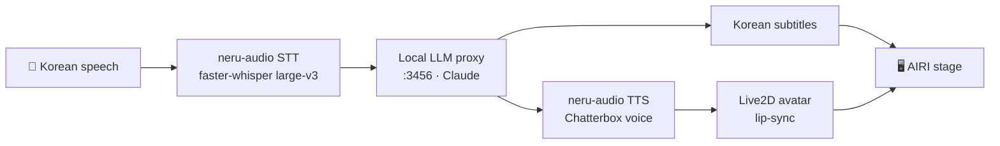

<!-- 프로젝트 소개(영문 기본 에디션) — KO/JA 에디션과 상단 링크로 연결 -->
# neru

**English** · [한국어](README.ko.md) · [日本語](README.ja.md)

> An AI VTuber built toward Neuro-sama–level presence. You speak **Korean**; neru
> answers in an **English voice** with **Korean subtitles** on screen, lip-synced
> by a Live2D avatar.

neru is a single desktop application: a vendored fork of [Project AIRI](https://github.com/moeru-ai/airi)
carries the app (avatar, chat, orchestration, subtitles), and neru's own asset —
a local **GPU voice stack** — is integrated as a service. The language model is a
pre-existing local, OpenAI-compatible proxy; neru just points at it.

---

## Why neru

Neuro-sama showed what a real-time, conversational AI VTuber can be. neru is an
attempt to reach that bar and go further, built as one vertical slice done well
before expanding: **the real-time voice conversation core** — speech in, a
spoken reply out, an avatar that reacts, subtitles in sync.

The signature is deliberate: **Korean understood, English spoken, Korean shown.**
You talk to neru in your language; neru performs in English (like Neuro-sama)
while the screen keeps you in Korean.

## How it works



- **STT / TTS** run locally on the GPU inside the `neru-audio` gateway.
- **The LLM** is the local OpenAI-compatible proxy at `localhost:3456` (Claude) —
  not part of this repo; neru only connects to it.
- **AIRI** handles the microphone, turn-taking, avatar, and subtitle rendering.

## Architecture

One system. Our unique, non-portable asset (Chatterbox voice cloning +
faster-whisper, both needing Python + CUDA) lives in a small HTTP gateway; the
rest is the AIRI fork.

| Piece | Role | Tech |
|-------|------|------|
| `airi/` (Project AIRI fork) | Desktop app: avatar, chat UI, orchestration, subtitles | Vue 3 · Electron · pnpm monorepo |
| `airi/services/neru-audio/` | OpenAI-compatible GPU voice gateway on `127.0.0.1:3457` | Python · FastAPI · Chatterbox TTS · faster-whisper STT |
| Local LLM proxy (optional) | User-configured OpenAI-compatible chat endpoint | e.g. `localhost:3456` |
| Codex (OAuth) (optional) | Desktop Codex app-server through Device OAuth | PATH `codex` CLI |

The desktop app (`airi/apps/stage-tamagotchi`, Electron) **auto-spawns** the
gateway in development. LLM, STT, and TTS providers are selectable in Settings;
Neru does not create an active provider, model, endpoint, or credential on a new install.
Choose either a configured local OpenAI-compatible endpoint or Codex (OAuth) for chat.

## Repository layout

```
neurosama-ai/
├─ airi/                            # the single runtime — vendored Project AIRI fork (MIT)
│  ├─ apps/stage-tamagotchi/        # Electron desktop app (auto-spawns the gateway)
│  ├─ services/neru-audio/          # Python GPU voice gateway (STT + TTS, OpenAI-compatible)
│  └─ …                             # rest of AIRI
├─ .github/workflows/               # CI: @claude assistant, advisory PR review
├─ docs/                            # specs & plans
└─ README · WORKSPACE · checklist   # project docs
```

## Getting started

**Prerequisites**

- Node.js + [pnpm](https://pnpm.io/) (the AIRI monorepo)
- Python 3.11 + [uv](https://docs.astral.sh/uv/) (the gateway)
- An NVIDIA GPU with CUDA (developed on an RTX 5080 / Blackwell, `torch 2.9.0+cu128`)
- The local OpenAI-compatible LLM proxy running on `localhost:3456`

**Run the desktop app** (from `airi/`):

```bash
cd airi
pnpm install
pnpm desktop        # ensures the Electron binary, then launches stage-tamagotchi
```

In development this auto-spawns the `neru-audio` gateway and shuts it down on
exit. To run the gateway on its own:

```bash
cd airi/services/neru-audio
uv run neru-audio   # serves 127.0.0.1:3457
```

## The neru-audio gateway

An OpenAI-compatible audio server so AIRI connects with zero custom code:

| Endpoint | Purpose |
|----------|---------|
| `POST /v1/audio/speech` | TTS — Chatterbox, a voice cloned from a short reference clip |
| `POST /v1/audio/transcriptions` | STT — faster-whisper large-v3, tuned for Korean |
| `GET /v1/models` | model list for client probes |

Requests to `/v1/audio/*` require an `Authorization: Bearer` token (default
`sk-local-proxy`, overridable via `NERU_API_KEY`) and are restricted to the
local host — a defense against drive-by requests from other pages while the
gateway is running. Binds to `127.0.0.1:3457` only.

## Autonomous development pipeline

The repo maintains itself with Claude, on a **human-in-the-loop** model — nothing
merges without a person:

- **Nightly security audit** and **bug hunt** (scheduled Claude routines) open
  GitHub issues for real findings, labeled `security` / `bug` / `claude-fix`.
- **Issue → fix** (a routine on the `claude-fix` label) opens a fix PR on a
  `claude/*` branch.
- **Advisory review** (`claude-fix-review.yml`) posts a `VERDICT:` recommendation
  on each fix PR. It is **review-only** — read + comment, no merge power — so a
  human always makes the final call. `master` is branch-protected.

## Roadmap

Full vision and phase status: **[`ROADMAP.md`](ROADMAP.md)** — 9 subprojects
(voice core, long-term memory, proactive speech, chat integration, broadcasting,
game agent, computer control / coding agent, multi-persona "Evil neru", YouTube
co-watching). The MVP (voice core) at a glance:

- ☑ AIRI fork running as the single system; local LLM via the proxy
- ☑ `neru-audio` GPU gateway (Chatterbox TTS + faster-whisper STT), auto-spawned
- ☑ Live loop end-to-end (mic → STT → LLM → TTS → avatar), verified
- ☑ neru persona / character card (preseeded, active)
- ◐ Bilingual output — **English voice + Korean subtitles**: voice + chat-panel Korean working; caption overlay in progress
- ☐ Barge-in (interrupt neru by speaking)
- ☐ neru's own witch Live2D model in the AIRI loader
- ☐ Rebrand + packaged desktop build with a bundled runtime

## Credits & license

- [Project AIRI](https://github.com/moeru-ai/airi) — MIT. Vendored under `airi/`;
  see `airi/LICENSE`.
- [Chatterbox](https://github.com/resemble-ai/chatterbox) (TTS) and
  [faster-whisper](https://github.com/SYSTRAN/faster-whisper) (STT) — MIT.
- Inspired by [Neuro-sama](https://www.twitch.tv/vedal987).

neru-specific code builds on the MIT-licensed components above. This is a
personal project; treat it as provided-as-is unless a top-level `LICENSE` says
otherwise.
